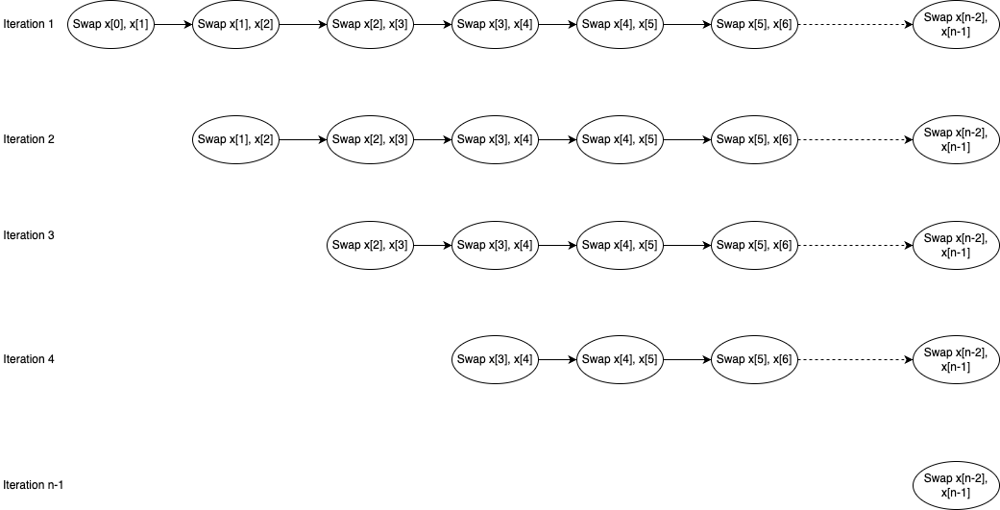
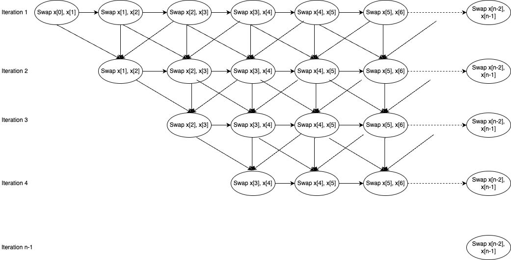

# Parallelism

**There is opportunities for parallelism in this algorithm**

- Task: swap 2 element in array. The algorithm can be broken into serveral swapping tasks that must be in an order. 

For sequential algorithm, tasks are done in order of iteration like first iteration will swap from element 0 to element N. Once first iteration is done, second iteration would start, not before first iteration is done.

We also notice that there is dependency between iteration 2 and iteration 1 in terms of swapping task. Iteration 1 cannot swap element 1 and element 2 until iteration 2 is done swapping element 0 and element 1, element 1 and element 2, element 2 and element 3. 

Here is the dependency graph of the swapping tasks for sequential algorithm:

We can make the algorithm become parallel by starting the iteration 2 once iteration 1 finishes swapping element 2 and element 3, and move on once the dependencies is resolved. 

The difference in parallel algorithm is we start next iteration without waiting for previous iteration to finish.